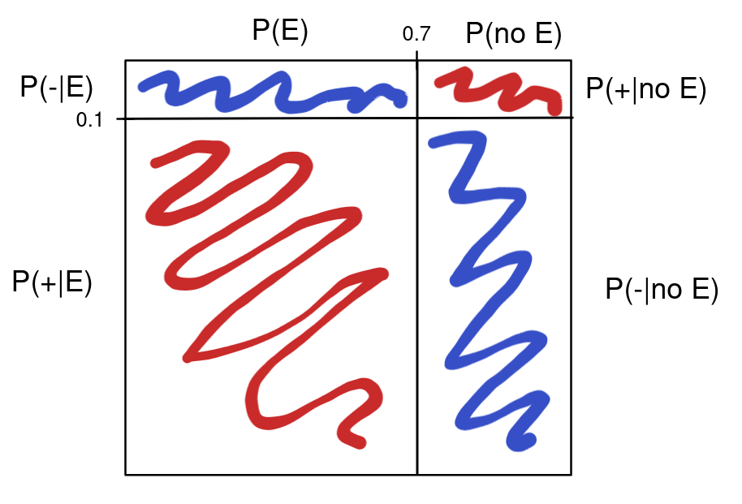

## Enunciado

#### 19)

Una sonda espacial pasa por las cercanías de Io, una de las lunas de Júpiter. Io es el objeto geológicamente
más activo del Sistema Solar, y durante el tiempo de contacto con la sonda hay una probabilidad de 70%
que dentro del campo de visión de esta se produzca una erupción volcánica. La sonda envía muchos datos a
la Tierra, entre ellos uno que indica si observó o no observó una erupción (siempre envía alguna de las dos
opciones). Por perturbaciones introducidas por campo magnético solar, sin embargo, hay una probabilidad
del 10% de que la información recibida de la sonda sea incorrecta. Si el sistema reporta que observó una
erupción, ¿Cuál es la probabilidad de que realmente lo haya hecho? [Rta: 0.9545]

## Solución
  
  

### 1- Pasando de texto a probabilidad

Lo primero que tenemos que hacer es pensar, en notación de probabilidad, qué es lo que nos dice el enunciado. Coloquialmente nos dice los siguientes datos importantes:

1. La sonda pasa por IO, y al pasar envía una señal diciendo si vió una erupción, o si no vió ninguna.
1. Durante el tiempo en el que la sonda pasa por IO, hay un 70% de chances de que efectivamente haya una erupción volcánica.
1. Hay un 10% de probabilidades de que la señal de la sonda sea incorrecta.
1. La sonda reporta que vió una erupción volcánica.

Entonces tenemos dos eventos que nos importan: si hubo ($E$) o no hubo ($\bar{E}$) una erupción volcánica, y si el "test" (que en este caso es lo que detecta la sonda) dió positivo $+$ (la sonda dice que vió una erupción) o negativo $-$ (la sonda dice que no vió nada). Entonces podemos usar notación de probabilidad para escribir los datos que pusimos en la lista anterior:

1. Durante el tiempo en el que la sonda pasa por IO, hay un 70% de chances de que efectivamente haya una erupción volcánica: $P(E)=0.7 \implies P(\bar{E}) = 0.3$.
1. Hay un 10% de probabilidades de que la señal de la sonda sea incorrecta: $P(+ \mid \bar{E}) = P(- \mid E) = 0.1 \implies P(+ \mid {E}) = P(- \mid \bar{E}) = 0.9$.

#### Sabemos

1. $P(\text{equivocarse}) = P(+ \mid \bar{E}) = P(- \mid E) = 0.1$
1. $P(\text{no equivocarse}) = P(+ \mid E) = P(- \mid \bar{E}) = 0.9$
1. $P(E) = 0.7$
1. $P(\bar{E}) = 0.3$

Pero, ¿qué es lo que nos preguntan escrito con notación de probabilidad?. Sabemos seguro que la sonda reportó $+$, y queremos saber cuál es la probabilidad de que efectivamente hubo una erupción, es decir la probabilidad de erupción dado $+$, $P(E \mid +)$.

#### Nos preguntan

$P(E \mid +)$

Es importante darse cuenta que esa probabilidad no es dato. El dato que tenemos nosotros es la probabilidad de que la sonda emita $+$ dado que hubo una erupción, que es $P(+ \mid E)$. Por suerte, el teorema de Bayes nos sirve para dar vuelta esa condición.
  
  

### 2- Aplicando el Teorema de Bayes

En general, el teorema dice que dados dos eventos $A$ y $B$, las probabilidades condicionales se relacionan de la forma

$$P(A \mid B) = \frac{P(B \mid A)P(A)}{P(B)}.$$

Para mi este teorema no es para nada intuitivo, pero [un video de 3b1b](https://www.youtube.com/watch?v=HZGCoVF3YvM&t=624s) me ayudó bastante a entenderlo mejor. En nuestro caso, $A=E$ y $B=+$. En palabras, el teorema de Bayes nos dice que la probabilidad de que haya ocurrido una erupción dado que la sonda envió $+$ es igual a la probabilidad de que la sonda haya enviado $+$ dado que hubo una erupción multiplicado por la probabilidad de que haya ocurrido una erupción, dividido por la probabilidad de que la sonda haya enviado $+$, que en notación sería

$$P(E \mid +) = \frac{P(+ \mid E) P(E)}{P(+)}.$$

Pero eso es un trabalenguas, así es imposible de entender. Como en el video, me parece que es más fácil pensar esto con el siguiente diagrama:

Este es un cuadrado donde todos sus lados son de longitud 1, y por lo tanto su área también es 1. Eso nos permite dividir sus lados en los distintos casos de nuestro problema cuyas probabilidades suman 1. En este caso, el lado horizontal del cuadrado representa la probabilidad de que haya una erupción: $P(E)=0.7$ y $P(\bar{E})=0.3$, la suma da 1. Podemos pensar que esto nos divide al cuadrado en dos universos posibles: el universo en el que hubo una erupción (el izquierdo) y el universo en el que no hubo erupción (el derecho). Ahora, en cada uno de esos universos pueden pasar dos cosas: la sonda evía $+$ ó, la sonda envía $-$. Estas probabilidades también son excluyentes y suman 1, por lo tanto las podemos representar como el lado vertical del cuadrado. Además, sabemos cuál es la probabilidad de que la sonda se equivoque, es decir $P(- \mid E) = 0.1 = P(+ \mid \bar{E})$ lo que nos permite dibujar una recta horizontal que nos vuelve a dividir al cuadrado en dos universos posibles: el universo en el que la sonda envió $+$ y el universo en el que envió $-$. Todas las subdivisiones del cuadrado que se hicieron al dibujar las lineas son los posibles casos de nuestro problema: $\\{ (E, +), (E, -), (\bar{E}, +), (\bar{E}, -) \\}$, que también son excluyentes y sus probabilidades suman 1 (como el área del cuadrado). Visualizándolo de esta forma, es facil ver que la probabilidad de que la sonda envíe $+$ está dada por el área roja del cuadrado, que la podemos calcular sumando el área de las dos subdivisiones rojas: $P(+) = P(+ \mid E) P(E) + P(+ \mid \bar{E}) P(\bar{E})$. Lo bueno de esto es que todas las probabilidades que aparecen ahí son dato! sólo queda hacer la cuenta.

$$\begin{align*}P(+) \&= P(+ \mid E) P(E) + P(+ \mid \bar{E}) P(\bar{E}) \\\\  &= 0.9 \times 0.7 + 0.1 \times 0.3 \\\\ &= 0.63 + 0.03 = 0.66.\end{align*}$$

Además, en esa cuenta calculamos el numerador de Bayes, $P(+ \mid E)P(E) = 0.63$. En total la cuenta da $\frac{0.63}{0.66}=0.9545$. Es decir, si la sonda envía un $+$, podemos estar un 95% seguros de que hubo una erupción en IO.